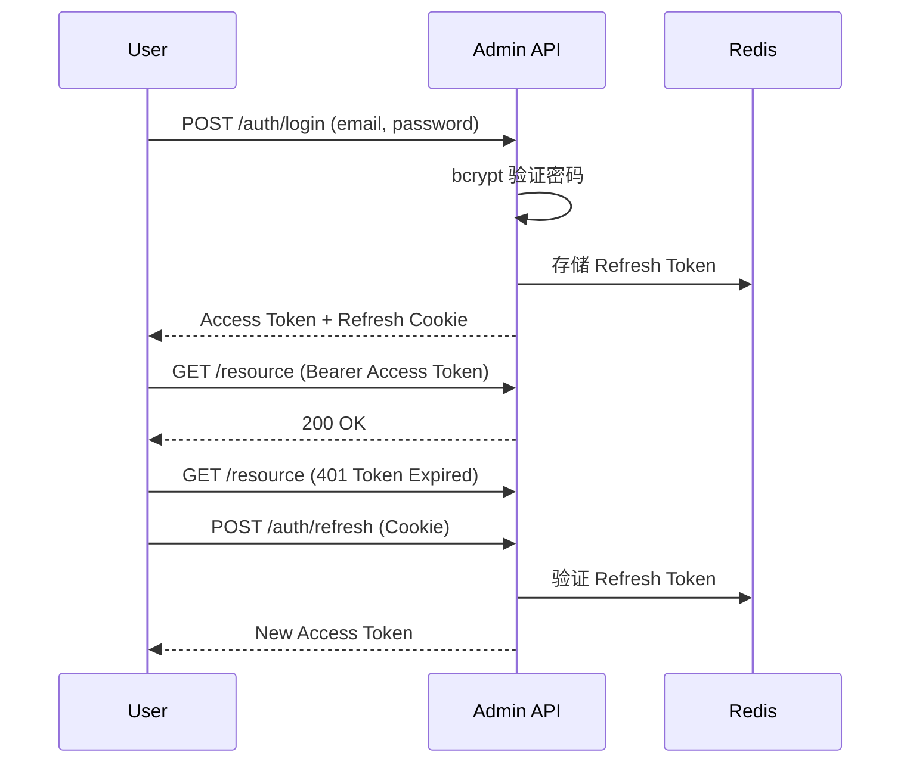
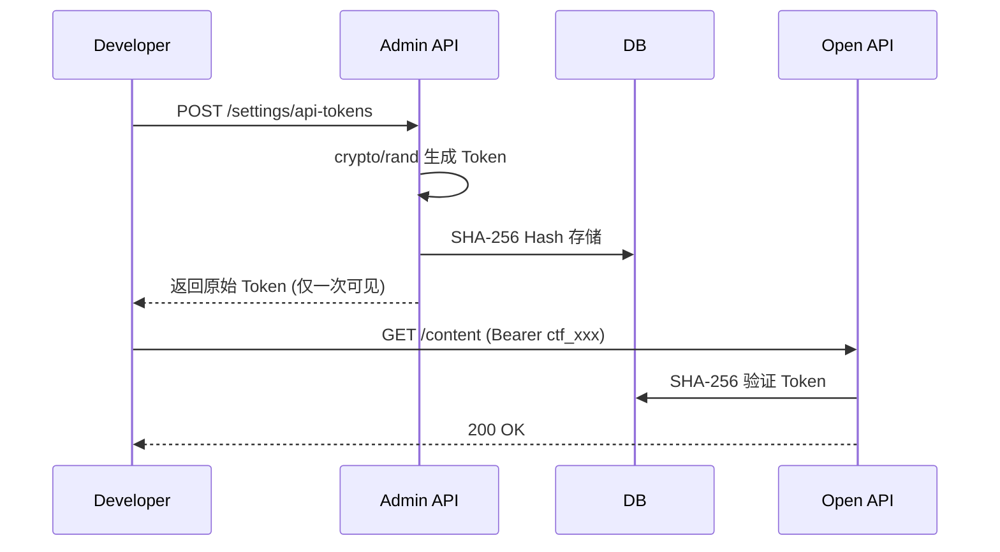

# ADR-0001: 技术栈选择

## 状态
**已接受**

## 上下文

我们需要为 Contful Headless CMS 选择技术栈。这是开源项目，需要考虑：
- 长期可维护性
- 团队技术储备
- 社区生态
- 部署便利性
- 与 Strapi 的差异化竞争

## 决策

我们选择以下技术栈：

### 后端
- **语言**: Go 1.22+
- **框架**: Gin v1.9+
- **ORM**: GORM v2
- **数据库**: PostgreSQL 18
- **缓存**: Redis 7
- **迁移**: golang-migrate

### 前端 (Console)
- **框架**: Vue 3.4+
- **UI 组件库**: TDesign Next
- **状态管理**: Pinia
- **构建工具**: Vite

### 部署
- **容器化**: Docker + Docker Compose
- **反向代理**: Nginx

## 选项分析

### 选项 1: Go + Gin + Vue 3 (已选)

**优点**:
- Go 高性能，适合 API 服务
- Gin 轻量灵活，社区活跃
- Vue 3 团队熟悉，学习曲线低
- TDesign 对企业用户友好

**缺点**:
- 不如 Node.js 生态丰富
- 招聘难度略高

### 选项 2: Node.js + NestJS + React

**优点**:
- 生态丰富，库多
- 全栈同语言，招聘容易

**缺点**:
- 性能不如 Go
- TypeScript 类型系统复杂

### 选项 3: Rust + Axum + React

**优点**:
- 极致性能
- 内存安全

**缺点**:
- 学习曲线陡峭
- 招聘困难
- 开发周期长

## 结论

选择 Go + Vue 3 平衡了性能、可维护性和团队能力，是适合 Contful 的选择。

## 后果

- ✅ 高性能 API 服务
- ✅ 代码简洁，易维护
- ⚠️ 招聘难度略高（但对开源社区影响有限）
- ⚠️ 某些库可能需要自行实现

---

# ADR-0002: 多站点架构设计

## 状态
**已接受**

## 上下文

Contful 的核心差异化是**多站点支持**。我们需要设计数据隔离策略：

1. **方案 A**: 共享数据库 + site_id 隔离（当前选择）
2. **方案 B**: 独立数据库
3. **方案 C**: Schema 隔离

## 决策

选择**方案 A: 共享数据库 + site_id 隔离**：

```sql
-- 每个站点级表包含 site_id
CREATE TABLE entries (
    id UUID PRIMARY KEY,
    site_id UUID NOT NULL REFERENCES sites(id),
    -- ... 其他字段
);

-- 查询时自动注入 site_id
SELECT * FROM entries WHERE site_id = $current_site_id;
```

## 权衡分析

| 维度 | 方案 A (已选) | 方案 B | 方案 C |
|------|-------------|--------|--------|
| 隔离程度 | 中 | 高 | 中高 |
| 运维复杂度 | 低 | 高 | 中 |
| 备份灵活性 | 中 | 高 | 中 |
| 成本 | 低 | 高 | 中 |
| 适合规模 | 1-100 站点 | 100+ 站点 | 10-1000 站点 |

## 结论

MVP 阶段选择方案 A，为未来演进到方案 B/C 预留扩展点。

## 后果

- ✅ 实现简单，迭代快
- ✅ 运维成本低
- ✅ 数据迁移方便
- ⚠️ 需要应用层严格控制 site_id
- ⚠️ 大规模场景可能需要迁移到方案 B

---

# ADR-0003: 动态内容存储方案

## 状态
**已接受**

## 上下文

Headless CMS 需要存储**动态内容类型**（用户定义的内容模型），每个类型字段不同。

### 选项分析

| 选项 | 描述 | 优点 | 缺点 |
|------|------|------|------|
| A: EAV | Entity-Attribute-Value 模式 | 灵活 | 查询复杂，性能差 |
| B: JSONB | 存储为 JSONB | 灵活，查询能力好 | 约束弱 |
| C: 动态建表 | 每个类型建表 | 性能好 | 迁移复杂 |
| **D: 混合方案 (已选)** | 辅助列 + JSONB | 平衡 | 实现复杂度 |

## 决策

采用**混合方案**：

```sql
CREATE TABLE entry_values (
    entry_id UUID REFERENCES entries(id),
    field_id UUID REFERENCES fields(id),
    
    -- 辅助列（用于索引和查询）
    value JSONB,           -- 完整值
    text_value TEXT,        -- 文本索引
    number_value NUMERIC,   -- 数值范围
    bool_value BOOLEAN,     -- 布尔过滤
    date_value DATE,        -- 日期查询
    
    PRIMARY KEY (entry_id, field_id)
);
```

## 结论

JSONB 存储值，辅助列提供查询优化，平衡了灵活性和性能。

## 后果

- ✅ 字段定义灵活
- ✅ 支持复杂类型（relation, media）
- ✅ 可按需建立索引
- ⚠️ 全文搜索不如专用搜索引擎
- ⚠️ 跨字段聚合查询复杂

---

# ADR-0004: API 分离策略

## 状态
**已接受**

## 上下文

我们需要区分管理 API（Console 用）和公开 API（第三方开发者用）。

### 选项分析

| 选项 | 描述 | 优点 | 缺点 |
|------|------|------|------|
| **A: 分离服务 (已选)** | 两个独立进程 | 隔离清晰，扩展灵活 | 资源占用高 |
| B: 统一服务 + 路由 | 同一服务，路由区分 | 资源占用低 | 边界模糊 |

## 决策

采用**分离服务架构**：

```
┌─────────────────────────────────────────────────────────┐
│                     Admin API (:8080)                    │
│  /admin/v1/*  │ JWT │ 全功能 │ Console 专用               │
└─────────────────────────────────────────────────────────┘

┌─────────────────────────────────────────────────────────┐
│                     Open API (:8081)                    │
│  /api/v1/*   │ Token │ 仅内容读写 │ 第三方开发者             │
└─────────────────────────────────────────────────────────┘
```

## 结论

两个独立服务通过路由前缀区分，通过 Nginx 统一对外暴露。

## 后果

- ✅ 职责清晰
- ✅ 可独立扩展
- ✅ 安全边界明确
- ⚠️ 需要维护两套代码（可共享部分）
- ⚠️ 部署复杂度略高

---

# ADR-0005: 认证策略

## 状态
**已接受**

## 上下文

需要为 Admin API 和 Open API 设计认证机制。

## 决策

| API | 认证方式 | Token 类型 | 有效期 |
|-----|----------|-----------|--------|
| Admin API | JWT Bearer | Access Token | 15 分钟 |
| Admin API | JWT Bearer | Refresh Token | 7 天 |
| Open API | API Token | `ctf_` 前缀 | 可配置 |

### Admin API 认证流程



### Open API 认证流程



## 结论

JWT 用于内部管理，API Token 用于第三方接入，分离设计更安全。

## 后果

- ✅ Admin 操作安全（短期 Token + Refresh）
- ✅ 第三方接入简单（静态 Token）
- ✅ 支持 Token 吊销（Redis + DB 删除）
- ⚠️ 需要安全存储 Refresh Token
- ⚠️ API Token 泄露风险（需 HTTPS + IP 白名单）

---

# ADR-0006: 禁止 Swagger/OpenAPI

## 状态
**已接受**

## 上下文

作为开源项目，我们需要 API 文档策略。

## 决策

**禁止集成 Swagger/OpenAPI**，采用手写 Markdown 文档。

### 文档产出

| 文档 | 位置 | 维护者 |
|------|------|--------|
| Admin API 规范 | `contful/docs/admin-api-spec.md` | 架构师 |
| Open API 规范 | `contful/docs/open-api-spec.md` | 架构师 |
| 开发者指南 | `website/docs/` | 文档工程师 |

### 理由

1. **维护成本**: Swagger 需要代码与注释同步更新，容易过时
2. **可读性**: Markdown 文档更适合详细说明和示例
3. **国际化**: 手写文档更容易适配多语言
4. **版本控制**: Markdown 更易于 Code Review

## 结论

采用 Markdown 手写文档，通过 CI 自动检查文档完整性。

## 后果

- ✅ 文档质量更高
- ✅ 便于 Code Review
- ✅ 灵活定制
- ⚠️ 需要额外维护工作
- ⚠️ 无法自动生成客户端 SDK

---

*ADR 由 Contful 架构师维护，最后更新: 2026-04-15*
