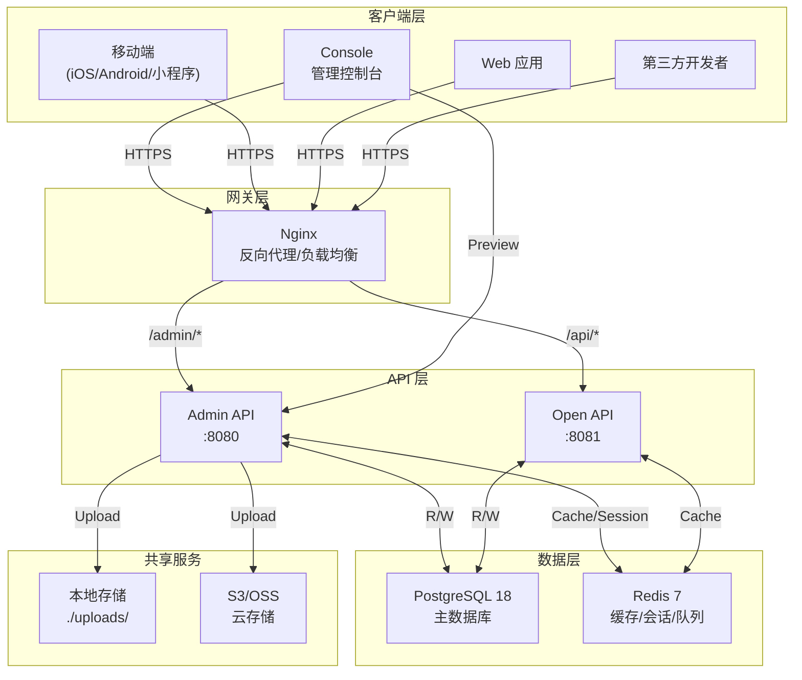
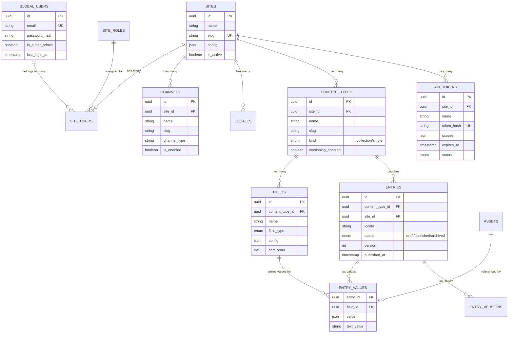

# Contful 系统架构文档

> 版本: v1.0.0
> 更新日期: 2026-04-15
> 状态: 已批准

---

## 1. 项目概述

### 1.1 什么是 Contful

**Contful** 是一款开源的 **Headless CMS**，旨在为开发者提供灵活、高效的内容管理解决方案。

**核心定位**：相比 Strapi 的单站点模式，Contful 的核心差异化是**多站点支持**——一套 CMS 实例可以管理多个独立站点，每个站点拥有独立的内容模型、数据和用户权限。

### 1.2 关键术语

| 术语 | 说明 |
|------|------|
| **Headless CMS** | 仅提供 API 的内容管理系统，前端与后端解耦 |
| **Site（站点）** | 独立的网站/应用，如政务官网、企业官网 |
| **Channel（渠道）** | 站点的展示终端，如 Web、iOS、Android、小程序 |
| **Content Type** | 内容类型定义，如 Article（文章）、Product（产品） |
| **Content Entry** | 实际的内容数据，如一篇具体文章 |
| **Locale** | 多语言版本，如 zh-CN、en-US |

---

## 2. 系统架构

### 2.1 整体架构图



### 2.2 服务分层

```
┌─────────────────────────────────────────────────────────────────┐
│                       客户端层 (Clients)                          │
│     Console (Vue 3) │ Web Apps │ Mobile Apps │ Third-party      │
└───────────────────────────────┬─────────────────────────────────┘
                                │ HTTPS
┌───────────────────────────────▼─────────────────────────────────┐
│                       Nginx 反向代理层                            │
│              路由分发 │ SSL 终止 │ 静态资源 │ gzip                 │
└───────────────────────────────┬─────────────────────────────────┘
                                │
        ┌───────────────────────┴───────────────────────┐
        │                                               │
┌───────▼───────┐                               ┌───────▼───────┐
│  Admin API    │                               │  Open API     │
│  /admin/v1/*  │                               │  /api/v1/*   │
├───────────────┤                               ├───────────────┤
│ 认证: JWT     │                               │ 认证: Token   │
│ 权限: RBAC    │                               │ 权限: Scope   │
│ 范围: 管理    │                               │ 范围: 读写    │
│ 调用方: Console│                               │ 调用方: 第三方│
└───────┬───────┘                               └───────┬───────┘
        │                                               │
        └───────────────────────┬───────────────────────┘
                                │
┌───────────────────────────────▼─────────────────────────────────┐
│                        PostgreSQL 18                             │
│  ┌─────────┐  ┌─────────┐  ┌─────────┐  ┌─────────┐              │
│  │ Sites   │  │ Content │  │  Users  │  │ Assets  │              │
│  │Channels │  │ Entries │  │  Roles  │  │ Tokens  │              │
│  │Locales  │  │ Fields  │  │  Perms  │  │ Webhooks│              │
│  └─────────┘  └─────────┘  └─────────┘  └─────────┘              │
└───────────────────────────────┬─────────────────────────────────┘
                                │
┌───────────────────────────────▼─────────────────────────────────┐
│                         Redis 7                                  │
│  Session │ Cache │ Rate Limit │ Distributed Lock                 │
└─────────────────────────────────────────────────────────────────┘
```

### 2.3 多站点架构

```
┌─────────────────────────────────────────────────────────────────┐
│                      Contful Instance                            │
│                                                                 │
│  ┌─────────────────────────────────────────────────────────┐    │
│  │                    全局共享层                             │    │
│  │  Global Users │ Plugins │ Audit Logs │ API Tokens        │    │
│  └─────────────────────────────────────────────────────────┘    │
│                                                                 │
│  ┌──────────────┐  ┌──────────────┐  ┌──────────────┐            │
│  │   Site A     │  │   Site B     │  │   Site C     │            │
│  │ (政务官网)    │  │ (企业官网)    │  │ (移动端)     │            │
│  ├──────────────┤  ├──────────────┤  ├──────────────┤            │
│  │ Channels:    │  │ Channels:    │  │ Channels:    │            │
│  │  - Web       │  │  - Web       │  │  - iOS       │            │
│  │  - WeChat    │  │  - App       │  │  - Android   │            │
│  ├──────────────┤  ├──────────────┤  ├──────────────┤            │
│  │ Content:     │  │ Content:     │  │ Content:     │            │
│  │  - Article   │  │  - Product   │  │  - News      │            │
│  │  - Page      │  │  - Category  │  │  - Notice    │            │
│  │  - Document  │  │  - FAQ       │  │  - Banner    │            │
│  └──────────────┘  └──────────────┘  └──────────────┘            │
└─────────────────────────────────────────────────────────────────┘
```

---

## 3. Admin API vs Open API

### 3.1 职责划分

| 维度 | Admin API | Open API |
|------|-----------|----------|
| **端口** | 8080 | 8081 |
| **路由前缀** | `/admin/v1/*` | `/api/v1/*` |
| **认证方式** | JWT Bearer Token | API Token (`ctf_` 前缀) |
| **主要功能** | 全功能管理 | 仅内容读写 |
| **调用方** | Console 控制台（内部） | 第三方开发者（外部） |
| **站点隔离** | 自动注入 | 需 Scope 指定 |
| **权限模型** | RBAC + 站点范围 | Token Scope |

### 3.2 API 路由示例

**Admin API**
```
POST   /admin/v1/auth/login              # 登录
GET    /admin/v1/users                    # 用户列表
POST   /admin/v1/sites                    # 创建站点
GET    /admin/v1/content-types            # 内容类型列表
POST   /admin/v1/content-types            # 创建内容类型
POST   /admin/v1/content-types/:id/fields # 添加字段
GET    /admin/v1/content/:slug           # 内容列表
POST   /admin/v1/content/:slug           # 创建内容
POST   /admin/v1/media/upload             # 上传媒体
GET    /admin/v1/settings/api-tokens     # API Token 列表
```

**Open API**
```
GET    /api/v1/sites/:slug/content/:type          # 读取内容列表
GET    /api/v1/sites/:slug/content/:type/:id       # 读取单条内容
POST   /api/v1/sites/:slug/content/:type           # 创建内容 (需 write scope)
PUT    /api/v1/sites/:slug/content/:type/:id       # 更新内容 (需 write scope)
DELETE /api/v1/sites/:slug/content/:type/:id        # 删除内容 (需 write scope)
```

---

## 4. 数据模型

### 4.1 核心实体关系



### 4.2 表清单

| 表名 | 说明 | 隔离级别 |
|------|------|----------|
| `global_users` | 全局用户（跨站点管理员） | 全局 |
| `global_roles` | 全局角色定义 | 全局 |
| `plugins` | 插件管理 | 全局 |
| `audit_logs` | 审计日志 | 全局/站点 |
| `sites` | 站点配置 | 站点 |
| `channels` | 渠道/终端配置 | 站点 |
| `locales` | 多语言配置 | 站点 |
| `site_users` | 用户-站点关联 | 站点 |
| `site_roles` | 站点角色 | 站点 |
| `content_types` | 内容类型定义 | 站点 |
| `fields` | 字段定义 | 站点 |
| `entries` | 内容条目 | 站点 |
| `entry_values` | 字段值 | 站点 |
| `entry_versions` | 版本历史 | 站点 |
| `assets` | 媒体资产 | 站点 |
| `api_tokens` | API Token | 站点 |
| `webhooks` | Webhook 配置 | 站点 |
| `webhook_deliveries` | Webhook 投递日志 | 站点 |

---

## 5. 安全性设计

### 5.1 认证体系

```
┌─────────────────────────────────────────────────────────────────┐
│                        认证架构                                   │
├─────────────────────────────────────────────────────────────────┤
│                                                                  │
│  Console 用户 (Admin API):                                       │
│  ┌─────────┐    ┌─────────┐    ┌─────────┐                      │
│  │ Login   │───▶│ JWT     │───▶│ Access  │                      │
│  │         │    │ (15min) │    │ Token   │                      │
│  └─────────┘    └────┬────┘    └─────────┘                      │
│                      │                                           │
│                 ┌────▼────┐    ┌─────────┐                      │
│                 │ Refresh │───▶│ Cookie  │                      │
│                 │ Token   │    │ (7days) │                      │
│                 └────┬────┘    └─────────┘                      │
│                      │                                           │
│                 ┌────▼────┐                                      │
│                 │ Redis   │  支持主动吊销                         │
│                 └─────────┘                                      │
│                                                                  │
│  第三方开发者 (Open API):                                         │
│  ┌─────────┐    ┌─────────────┐                                  │
│  │ Create  │───▶│ Token Hash  │                                  │
│  │ Token   │    │ (SHA-256)  │                                  │
│  └─────────┘    └──────┬──────┘                                  │
│                        │                                         │
│                 ┌──────▼──────┐                                  │
│                 │ Bearer      │                                  │
│                 │ ctf_xxxx    │                                  │
│                 └─────────────┘                                  │
│                                                                  │
└─────────────────────────────────────────────────────────────────┘
```

### 5.2 权限模型

```
Global Permissions:
├── system.admin           # 系统管理员
├── plugins.manage         # 插件管理
└── audit.read             # 审计日志读取

Site-level Permissions:
├── site.settings          # 站点设置
├── site.users             # 用户管理
├── content.*              # 内容管理（所有类型）
├── content.article        # 仅文章管理
├── media.*                # 媒体管理
└── api_tokens.*           # API Token 管理

Channel-level Permissions:
├── channel.{slug}.publish # 发布到指定渠道
└── channel.{slug}.view   # 查看渠道配置
```

---

## 6. 扩展性设计

### 6.1 插件系统架构 (Phase 2)

```
┌─────────────────────────────────────────────────────────────────┐
│                       Plugin Architecture                        │
├─────────────────────────────────────────────────────────────────┤
│                                                                  │
│  ┌─────────────────────────────────────────────────────────┐    │
│  │                    Plugin Manager                        │    │
│  │  注册 │ 安装 │ 卸载 │ 启用 │ 禁用 │ 生命周期管理            │    │
│  └─────────────────────────────────────────────────────────┘    │
│                              │                                   │
│  ┌───────────┬───────────┬───────────┬───────────┐            │
│  │           │           │           │           │            │
│  ▼           ▼           ▼           ▼           ▼            │
│ ┌────┐    ┌────┐    ┌────┐    ┌────┐    ┌────┐                │
│ │ SEO │    │ i18n│    │ Sitemap│   │ Comment│   │ Custom │      │
│ │Plugin│   │Plugin│   │Plugin │   │Plugin │   │ Plugin │        │
│ └────┘    └────┘    └────┘    └────┘    └────┘                │
│                                                                  │
│  ┌─────────────────────────────────────────────────────────┐    │
│  │                    Plugin API                             │    │
│  │  ┌─────────┐ ┌─────────┐ ┌─────────┐ ┌─────────┐        │    │
│  │  │ Hooks   │ │Filters  │ │Actions  │ │ Services│        │    │
│  │  └─────────┘ └─────────┘ └─────────┘ └─────────┘        │    │
│  └─────────────────────────────────────────────────────────┘    │
│                                                                  │
└─────────────────────────────────────────────────────────────────┘
```

### 6.2 多租户演进 (Phase 3)

```
Level 1: 单站点隔离 (MVP)
└── 每个表通过 site_id 隔离

Level 2: Schema 级别多租户
└── 所有站点共享同一数据库 Schema
└── 优点: 运维简单
└── 缺点: 备份/迁移粒度粗

Level 3: 数据库级别多租户 (未来)
└── 每个站点独立数据库
└── 优点: 完全隔离，备份灵活
└── 缺点: 运维成本高
```

---

## 7. 非功能性需求

### 7.1 性能目标

| 指标 | 目标值 |
|------|--------|
| API P99 响应时间 | < 200ms |
| API QPS 支持 | 1000+ |
| Console 首屏加载 | < 3s |
| 支持并发用户 | 100+ |

### 7.2 可用性目标

| 版本 | SLA | RTO | RPO |
|------|-----|-----|-----|
| 开源版 | 无保证 | 用户自定 | 用户自定 |
| SaaS 版 | 99.9% | < 1h | < 1h |
| 商业版 | 99.99% | < 15min | < 5min |

### 7.3 演进时间线

```
2026 Q2          2026 Q3          2026 Q4          2027 Q1          2027 Q2+
   |                |                |                |                |
   ▼                ▼                ▼                ▼                ▼
┌─────────┐    ┌─────────┐    ┌─────────┐    ┌─────────┐    ┌─────────┐
│  M0-M1  │    │  M2-M3  │    │   SaaS  │    │ SaaS+   │    │Enterprise│
│ 开源 MVP │ → │ 开源增强 │ → │  Beta   │ → │ 正式版  │ → │   Beta   │
│ 当前开发 │    │ 插件系统 │    │ 限流计费 │    │多租户  │    │ SSO审计  │
└─────────┘    └─────────┘    └─────────┘    └─────────┘    └─────────┘
```

详细里程碑定义见 `ai/memory-bank/roadmap.md`

### 7.3 可观测性

- **日志**: 结构化日志 (zerolog)，支持 JSON 格式输出
- **指标**: Prometheus 格式指标端点 (`/metrics`)
- **追踪**: OpenTelemetry 分布式追踪
- **健康检查**: `/health` (liveness) + `/ready` (readiness)

---

## 8. 部署架构

### 8.1 开发环境

```
docker-compose.dev.yml:
├── postgres:18
├── redis:7
├── admin-api (:8080)
└── open-api (:8081)
```

### 8.2 生产环境

```
┌─────────────────────────────────────────────────────────────────┐
│                       生产部署架构                               │
├─────────────────────────────────────────────────────────────────┤
│                                                                  │
│                    ┌─────────────┐                              │
│                    │   CDN/WAF   │                              │
│                    │ Cloudflare  │                              │
│                    └──────┬──────┘                              │
│                           │                                      │
│                    ┌──────▼──────┐                              │
│                    │   Nginx     │                              │
│                    │   (LB)      │                              │
│                    └──┬───────┬──┘                              │
│                       │       │                                 │
│              ┌────────┘       └────────┐                        │
│              ▼                         ▼                        │
│     ┌─────────────┐            ┌─────────────┐                 │
│     │  Admin API  │            │   Open API  │                 │
│     │  (x2, HA)   │            │   (x2, HA)  │                 │
│     └──────┬──────┘            └──────┬──────┘                 │
│            │                          │                        │
│     ┌──────┴──────┐            ┌──────┴──────┐                 │
│     ▼             ▼            ▼             ▼                 │
│ ┌───────┐   ┌───────┐     ┌───────┐   ┌───────┐                │
│ │ PG    │   │ Redis │     │ PG    │   │ OSS   │                │
│ │Primary│   │Cluster│     │Replica│   │ COS   │                │
│ └───────┘   └───────┘     └───────┘   └───────┘                │
│                                                                  │
└─────────────────────────────────────────────────────────────────┘
```

---

## 9. 文档索引

| 文档 | 位置 |
|------|------|
| 架构文档 | `contful/docs/architecture.md` |
| API 规范 | `contful/docs/admin-api-spec.md`, `contful/docs/open-api-spec.md` |
| 数据库 ERD | `contful/docs/database-erd.md` |
| ADR 决策记录 | `contful/docs/adr/` |
| 安全基线 | `contful/docs/security-baseline.md` |
| 部署指南 | `deploy/` |

---

## 10. 版本历史

| 版本 | 日期 | 修改内容 | 作者 |
|------|------|----------|------|
| v1.0.0 | 2026-04-15 | 初始架构设计 | 架构师 |
